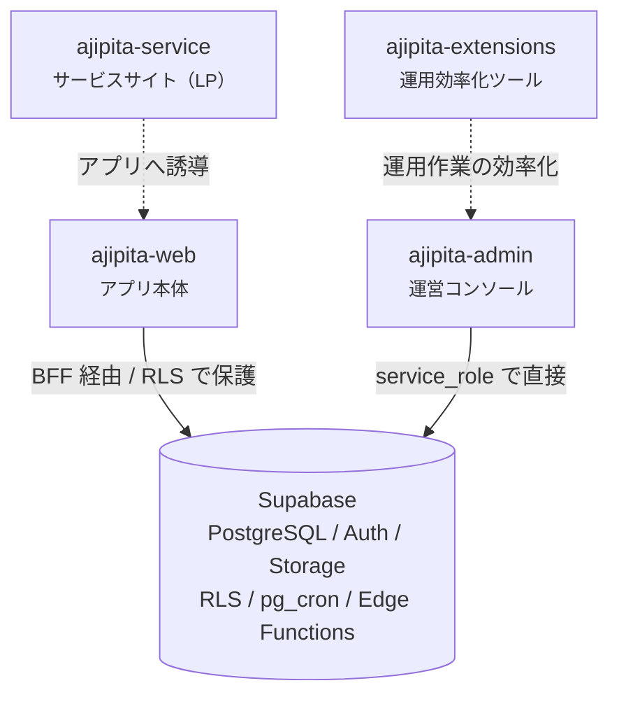

# 1. 全体構成

← [トップに戻る](../README.md)

---

## 1.1 4 つのリポジトリ

あじぴたは 4 つのリポジトリで構成されています。



| リポジトリ | 役割 | 公開範囲 |
| --- | --- | --- |
| **ajipita-web** | アプリ本体。ユーザーが使う画面のすべて | 一般公開 |
| **ajipita-admin** | 運営コンソール。通報対応・店舗申請・お知らせ配信 | 運営のみ |
| **ajipita-service** | サービスサイト（LP）。アプリへの誘導が役割 | 一般公開 |
| **ajipita-extensions** | 運用作業を効率化するために自作した Chrome 拡張群 | 自分のみ |

サービスサイトをアプリ本体と分けたのは、**役割が違うから**です。LP はブランド体験と誘導が仕事で、
静的中心・DB 不要。アプリ本体の認証やデータアクセスの制約を持ち込む必要がありません。
デザイントークンだけは共有して、ビジュアルの一貫性を保っています。

運用していると、手作業で繰り返すタスクが出てきます。そういうものは**その都度ツールを作って潰す**
方針で、Chrome 拡張もその 1 つです。

---

## 1.2 同じ DB を 2 つの流儀で触る

この構成で一番特徴的なのは、**web と admin が同じデータベースに対してまったく違うアクセスの仕方をする**点です。

| | ajipita-web | ajipita-admin |
| --- | --- | --- |
| データアクセス | BFF（API 層）に一本化 | 管理者権限のクライアントで直接 |
| 権限制御 | **RLS（Row Level Security）** | RLS をバイパス |
| 認証 | Supabase Auth（マジックリンク + Google） | 独立したテーブル + 自前の署名 Cookie |
| ユーザー体系 | サービスのユーザー | 運営スタッフ（サービスユーザーとは完全に別） |
| マイグレーション管理 | **こちらが正** | 持たない（web を参照） |

### なぜ流儀を変えたのか

**web は「信頼できないクライアント」が相手**です。ブラウザから来るリクエストは疑ってかかる必要があり、
DB 側で行レベルの権限を強制する RLS が防衛線になります。アプリのコードにバグがあっても、
DB が最後に止めてくれる状態を作りたい。

**admin は「信頼された運営面」が相手**です。運営スタッフは全データを見る必要があります
（通報された口コミの確認、ユーザーの状態調査など）。ここに RLS を敷くと、
「全部見えるようにするためのポリシー」を書くことになり、**RLS を使う意味がなくなります**。
それなら最初からバイパスして、代わりに**アクセスできる人間を絞る**方が素直です。

だから admin の認証はサービス側と完全に分離しています。サービスのユーザーがどれだけ増えても、
admin に入れる人間は増えません。

### マイグレーションを web に集約した理由

同じ DB を触る 2 つのリポジトリが、それぞれマイグレーションを持つと**適用順序が破綻します**。
どちらが先に走るかで DB の状態が変わってしまう。

そこで、**スキーマ変更は web リポジトリだけが持つ**と決めました。admin が必要とするテーブル
（運営スタッフのアカウントなど）も、web 側のマイグレーションとして管理します。
admin は既にあるスキーマを前提に動くだけです。

---

## 1.3 規約をどう共有するか

4 つのリポジトリで、命名規則・ディレクトリ構成・デザイントークンを揃えたい。
でもリポジトリは分かれている。

採った方法は、**web を正として、他リポジトリが同期スクリプトで取り込む**形です。

```
ajipita-web/docs/development/rules.md          ← 正本
        │
        │  sync-web-rules.sh
        ▼
ajipita-admin/docs/vendor/rules.md             ← コピー（手編集しない）
ajipita-service/docs/vendor/rules.md           ← コピー（手編集しない）
```

`vendor/` という名前にしているのは、**外から持ち込んだもので、ここでは編集しない**という
意思表示です。変更したければ web 側を直して、同期し直す。

### ドリフトは前提として受け入れる

この方式は完璧ではありません。web を更新しても、同期スクリプトを流すまで他リポジトリは古いままです。
つまり**ズレ（ドリフト）が必ず発生する**。

それでも採ったのは、代替案がもっと重いからです。

| 案 | 問題 |
| --- | --- |
| モノレポにする | 4 つのデプロイ先・デプロイ頻度が違う。CI が複雑になる |
| npm パッケージとして共有 | 規約ドキュメントのためにパッケージ公開とバージョン管理をするのは重い |
| Git submodule | 扱いが面倒で、更新忘れはどのみち起きる |
| **同期スクリプト** | ドリフトするが、仕組みが単純で壊れにくい |

ドリフトが実害になるのは「web で規約を変えたのに admin が古い規約で実装される」ケースですが、
これは**同期を流せば直る**し、流し忘れても既存コードが壊れるわけではありません。
リスクの大きさと仕組みの複雑さを天秤にかけて、単純な方を選びました。

---

## 1.4 この構成の良かった点・つらい点

### 良かった点

- **admin の存在が web を単純にした。** 運営機能を web に同居させると、
  「一般ユーザーには見せない画面」を RLS と UI の両方で守ることになります。
  リポジトリごと分けたことで、web は一般ユーザーのことだけ考えればよくなりました
- **LP を分けたので、アプリの都合に縛られない。** LP は静的中心で高速。
  アプリ側の認証やデータ取得の制約が一切かかりません
- **マイグレーションの集約は正解だった。** 同期の問題が構造的に起きません

### つらい点

- **横断的な変更が 2 〜 3 リポジトリに散る。** 例えば Cookie の仕様を変えるとき、
  web と service の両方を同時に直す必要があります。片方だけ直すと**エラーにならずに静かに壊れる**
  （実際に一度やりました → [6 章](./06-cost.md) や [4 章](./04-backend.md) で触れます）
- **同期スクリプトを流し忘れる。** 人間の運用に依存している部分です
- **admin のスキーマを web で管理するのは、最初は違和感がある。** 慣れると合理的ですが、
  「admin のテーブルなのに admin リポジトリに無い」状態は説明が要ります

---

## 1.5 まとめ

- 4 リポジトリ構成。**役割が違うものは分ける**方針
- 同じ DB でも、**信頼できるクライアントかどうか**でアクセスの流儀を変えている
- スキーマの正本は 1 箇所に集約する
- 規約の共有はドリフトを受け入れて、**仕組みの単純さ**を取った

次章では、この構成を決めることになった**プロダクト側の設計**を見ていきます。
実は「料理単位で評価する」という 1 つの仕様が、DB の選定まで一直線に決めていました。

→ [2. プロダクト設計](./02-product-design.md)
