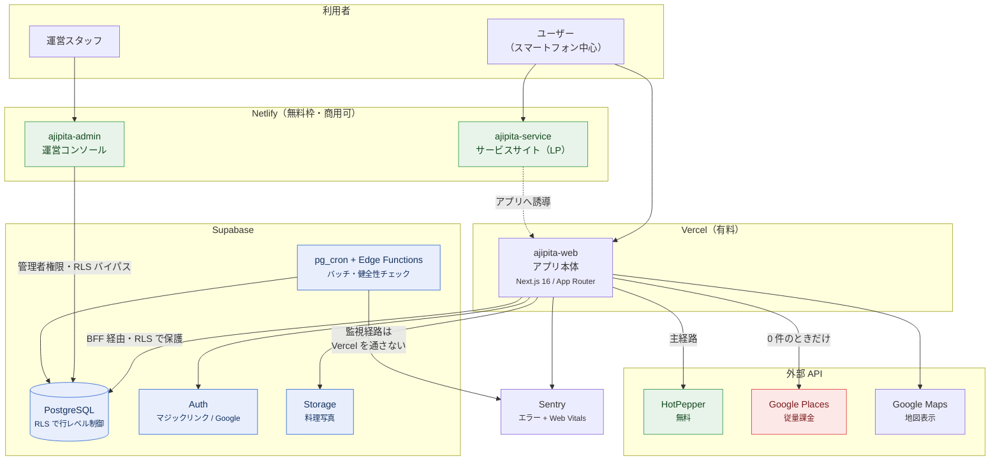
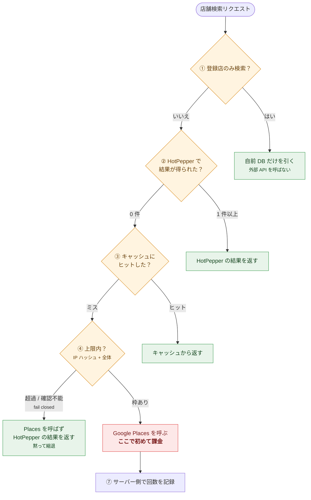
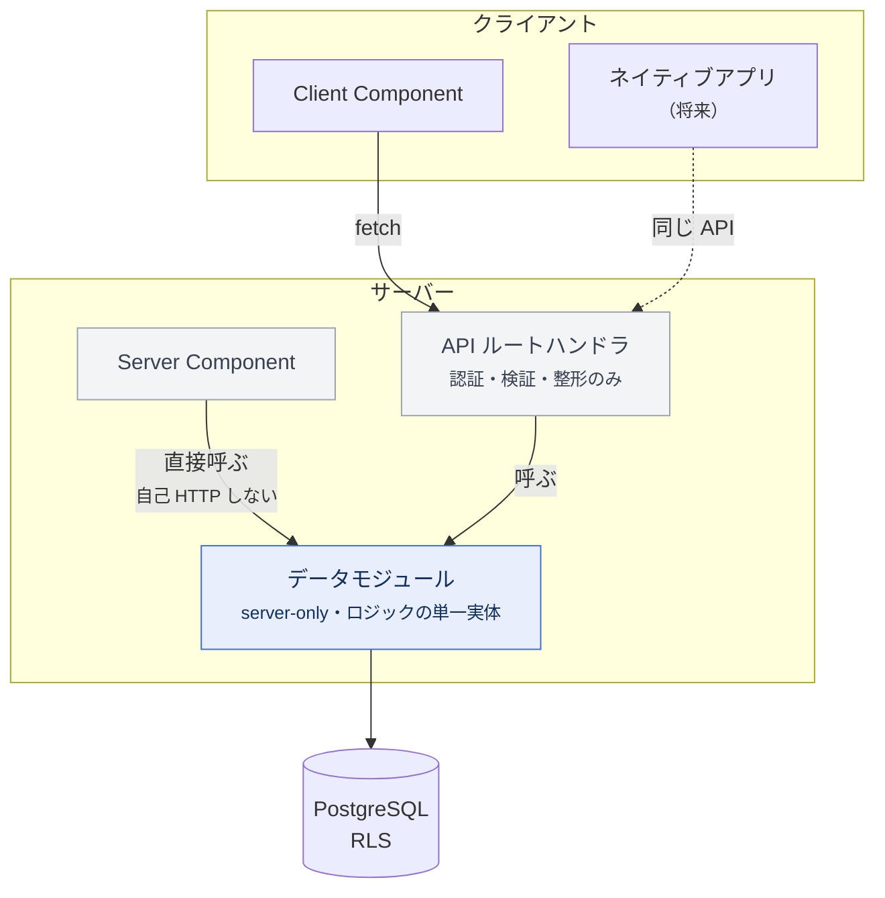
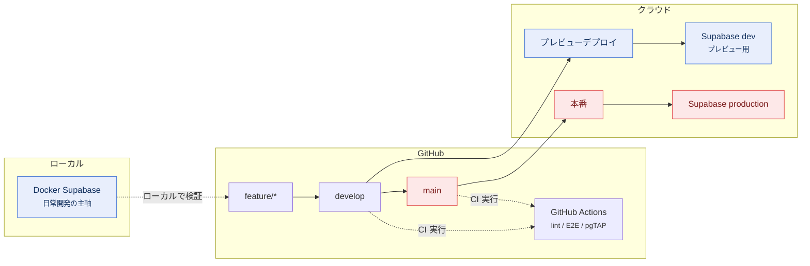

# 構成図（ドラフト）

> 各章へ組み込む前の確認用。方向性が固まったら該当章へ移す。

---

## A. インフラ全体構成

---

## B. 店舗検索のコスト防壁

6 章の 8 層を、リクエストの流れとして表したもの。

> ⑤（台帳の権限を配らない）と ⑥（フィールド最小化）は流れの中ではなく
> 上限判定と API 呼び出しの**内側**に効くため、この図には現れません。
> ⑧（提示済み ID の allowlist）は店舗詳細の別経路です。

---

## C. データアクセス境界（BFF）

4 章の構成。ロジックの置き場所と到達方法を分けている。

---

## D. 環境の 3 層とデプロイ

